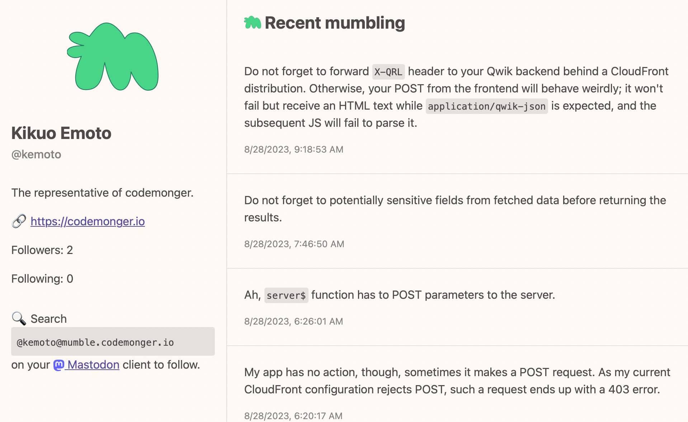

# Viewer Qwik App

[Qwik](https://qwik.builder.io) app to view public contents on Mumble.



If you want to see the app in action, please see my _mumbling_ at [https://mumble.codemonger.io/viewer/users/kemoto/](https://mumble.codemonger.io/viewer/users/kemoto/).

## Endpoints

The app is bundled in the [CDK stack](../README.md) and served under the path `/viewer/`.
- `/viewer/users/[id]/`: serves user's profile, where `[id]` is the user ID: e.g., `/viewer/users/kemoto/`.
  This path is redirected to activities page (`/viewer/users/[id]/activities/`).
- `/viewer/users/[id]/activities/`: serves user's public activities: e.g., `/viewer/users/kemoto/activities/`.

## Configuration

This section describes how to configure the app for development.
As long as you bundle the app through the CDK stack, you do not have to worry about this section.

### AWS credentials

This app needs AWS credentials with sufficient privileges to access the AWS resources of Mumble.
If you want to use a profile on your local machine, you can specify it to `AWS_PROFILE` environment variable.
Here is an example in my case:

```sh
export AWS_PROFILE=codemonger-jp
```

### Setting the basepath

If you want to serve this app under a basepath other than the root ('/'), you have to specify the basepath to `DISTRIBUTION_BASEPATH` environment variable.
For example, if you want to serve the app under `/viewer/` basepath:

```sh
export DISTRIBUTION_BASEPATH=/viewer/
```

### Parameter path for domain name

The Mumble service supposes the domain name to be in [Parameter Store on AWS Systems Manager](https://docs.aws.amazon.com/systems-manager/latest/userguide/systems-manager-parameter-store.html).
If you want to test the domain name in Parameter Store, you have to specify the path to the parameter to `DOMAIN_NAME_PARAMETER_PATH` environment variable.
The following command configures the environment variable with the output from the CDK stack:

```sh
export DOMAIN_NAME_PARAMETER_PATH=`aws cloudformation describe-stacks --stack-name mumble-development --query "Stacks[0].Outputs[?OutputKey=='DomainNameParameterPath'].OutputValue" --output text`
```

The domain name in Parameter Store precedes [`ORIGIN` environment variable](https://qwik.builder.io/docs/deployments/node/#production-deploy).

### User table name

Please specify the name of the DynamoDB table for users to `USER_TABLE_NAME` environment variable.
The following command configures the environment variable with the output from the CDK stack:

```sh
export USER_TABLE_NAME=`aws cloudformation describe-stacks --stack-name mumble-development --query "Stacks[0].Outputs[?OutputKey=='UserTableName'].OutputValue" --output text`
```

### Object table name

Please specify the name of the DynamoDB table for objects to `OBJECT_TABLE_NAME` environment variable.
The following command configures the environment variable with the output from the CDK stack:

```sh
export OBJECT_TABLE_NAME=`aws cloudformation describe-stacks --stack-name mumble-development --query "Stacks[0].Outputs[?OutputKey=='ObjectTableName'].OutputValue" --output text`
```

### S3 bucket name for objects

Please specify the name of the S3 bucket that stores objects to `OBJECTS_BUCKET_NAME` environment variable.
The following command configures the environment variable with the output from the CDK stack:

```sh
export OBJECTS_BUCKET_NAME=`aws cloudformation describe-stacks --stack-name mumble-development --query "Stacks[0].Outputs[?OutputKey=='ObjectsBucketName'].OutputValue" --output text`
```

### Parameter path for the OpenAI API key

Please specify the path to the parameter that stores the OpenAI API key in the Parameter Store on AWS Systems Manager to `OPENAI_API_KEY_PARAMETER_PATH` environment variable.

```sh
export OPENAI_API_KEY_PARAMETER_PATH=`aws cloudformation describe-stacks --stack-name mumble-development --query "Stacks[0].Outputs[?OutputKey=='OpenAiApiKeyParameterPath'].OutputValue" --output text`
```

### Name of the Lambda function that searches similar mumblings

Please specify the name of the Lambda function that searches similar mumblings to `SEARCH_SIMILAR_MUMBLINGS_FUNCTION_NAME` environment variable.

```sh
export SEARCH_SIMILAR_MUMBLINGS_FUNCTION_NAME=`aws cloudformation describe-stacks --stack-name mumble-development --query "Stacks[0].Outputs[?OutputKey=='SearchSimilarMumblingsFunctionName'].OutputValue" --output text`
```

## FYI: The following sections are auto-generated from the Qwik CLI

- [Qwik Docs](https://qwik.builder.io/)
- [Discord](https://qwik.builder.io/chat)
- [Qwik GitHub](https://github.com/BuilderIO/qwik)
- [@QwikDev](https://twitter.com/QwikDev)
- [Vite](https://vitejs.dev/)

---

## Project Structure

This project is using Qwik with [QwikCity](https://qwik.builder.io/qwikcity/overview/). QwikCity is just an extra set of tools on top of Qwik to make it easier to build a full site, including directory-based routing, layouts, and more.

Inside your project, you'll see the following directory structure:

```
├── public/
│   └── ...
└── src/
    ├── components/
    │   └── ...
    └── routes/
        └── ...
```

- `src/routes`: Provides the directory-based routing, which can include a hierarchy of `layout.tsx` layout files, and an `index.tsx` file as the page. Additionally, `index.ts` files are endpoints. Please see the [routing docs](https://qwik.builder.io/qwikcity/routing/overview/) for more info.

- `src/components`: Recommended directory for components.

- `public`: Any static assets, like images, can be placed in the public directory. Please see the [Vite public directory](https://vitejs.dev/guide/assets.html#the-public-directory) for more info.

## Add Integrations and deployment

Use the `npm run qwik add` command to add additional integrations. Some examples of integrations includes: Cloudflare, Netlify or Express Server, and the [Static Site Generator (SSG)](https://qwik.builder.io/qwikcity/guides/static-site-generation/).

```shell
npm run qwik add # or `yarn qwik add`
```

## Development

Development mode uses [Vite's development server](https://vitejs.dev/). The `dev` command will server-side render (SSR) the output during development.

```shell
npm start # or `yarn start`
```

> Note: during dev mode, Vite may request a significant number of `.js` files. This does not represent a Qwik production build.

## Preview

The preview command will create a production build of the client modules, a production build of `src/entry.preview.tsx`, and run a local server. The preview server is only for convenience to preview a production build locally and should not be used as a production server.

```shell
npm run preview # or `yarn preview`
```

## Production

The production build will generate client and server modules by running both client and server build commands. The build command will use Typescript to run a type check on the source code.

```shell
npm run build # or `yarn build`
```
