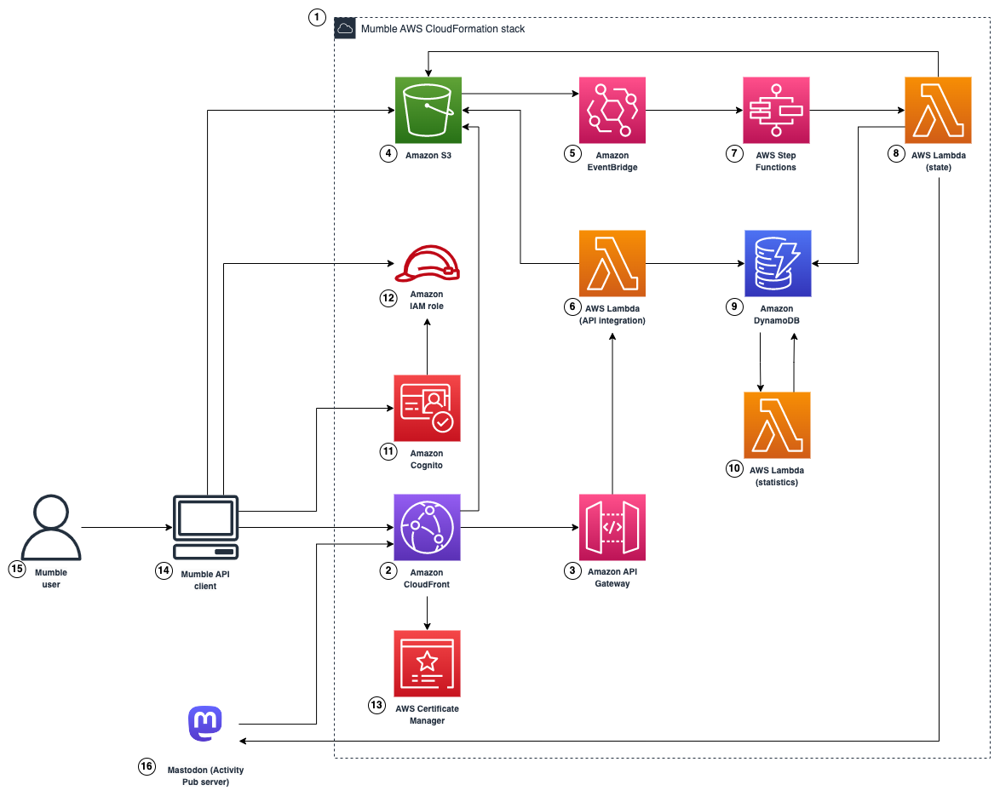

# Mumble Service Architecture

## AWS architecture overview

The following diagram shows the overview of the [AWS](https://aws.amazon.com) architecture.

(The diagram was made with [draw.io desktop](https://www.drawio.com).)

The following subsections briefly describe each component.

### ① Mumble AWS CloudFormation stack

All the resources of the Mumble service are described with [AWS Cloud Development Kit (CDK)](https://aws.amazon.com/cdk/) and deployed as a [AWS CloudFormation](https://aws.amazon.com/cloudformation/) stack.
Please refer to the [`/cdk` folder](../cdk/) for more details.

### ② Amazon CloudFront

The [Amazon CloudFront](https://aws.amazon.com/cloudfront/) distribution faces the Internet and serves the [REST API (Amazon API Gateway)](#-amazon-api-gateway) and [media files (Amazon S3)](#-amazon-s3).
What [Mumble API clients](#-mumble-api-client) recognize as the Mumble API is delivered from this distribution.
A custom domain name may be associated with this distribution, and its certificate is managed by [AWS Certificate Manager](#-aws-certificate-manager).

### ③ Amazon API Gateway

The REST API on [Amazon API Gateway](https://aws.amazon.com/api-gateway/) provides the endpoints of the Mumble API.
The endpoints include those required for [Activity Pub](https://www.w3.org/TR/activitypub/) and [WebFinger](https://webfinger.net)\*.
Thanks to [Redoc](https://github.com/Redocly/redoc), the OpenAPI documentation is available at [https://redocly.github.io/redoc/?url=https://raw.githubusercontent.com/codemonger-io/mumble/main/cdk/openapi/api-production.json](https://redocly.github.io/redoc/?url=https://raw.githubusercontent.com/codemonger-io/mumble/main/cdk/openapi/api-production.json).

Most of the endpoints are implemented with [API integration functions (AWS Lambda)](#-aws-lambda-api-integration).

Some endpoints need user authentication, and a [client](#-mumble-api-client) has to provide an ID token issued by the [user pool (Amazon Cognito)](#-amazon-cognito) to access them.

\* [WebFinger is required by Mastodon](https://docs.joinmastodon.org/spec/webfinger/) to locate accounts on distributed networks.

### ④ Amazon S3

The [Amazon S3](https://aws.amazon.com/s3/) bucket stores [Activity Pub](https://www.w3.org/TR/activitypub/) objects and media files.

Changes in the bucket trigger [workflows (AWS Step Functions)](#-aws-step-functions) via [Amazon EventBridge](#-amazon-eventbridge).

### ⑤ Amazon EventBridge

[Amazon EventBridge](https://aws.amazon.com/eventbridge/) rules fire events when objects are created, updated, or deleted in the [Amazon S3 bucket](#-amazon-s3).

### ⑥ AWS Lambda (API integration)

This group of [AWS Lambda](https://aws.amazon.com/lambda/) functions implements the API integrations of the [REST API on Amazon API Gateway](#-amazon-api-gateway).

The Lambda function that receives an [Activity Pub](https://www.w3.org/TR/activitypub/) object posted to the "inbox" endpoint of the Mumble API is in this group.
The function validates the object and saves it in the [Amazon S3 bucket](#-amazon-s3).

### ⑦ AWS Step Functions

State machines on [AWS Step Functions](https://aws.amazon.com/step-functions/) implement the workflows to handle inbound and outbound [Activity Pub](https://www.w3.org/TR/activitypub/) objects.

States of the state machines are implemented with [state functions (AWS Lambda)](#-aws-lambda-state).

### ⑧ AWS Lambda (state)

This group of [AWS Lambda](https://aws.amazon.com/lambda/) functions implements states of the [state machines on AWS Step Functions](#-aws-step-functions).

### ⑨ Amazon DynamoDB

There are two [Amazon DynamoDB](https://aws.amazon.com/dynamodb/) tables.
1. "user table" manages user information
2. "object table" manages metadata of [Activity Pub](https://www.w3.org/TR/activitypub/) activities and objects

[DynamoDB Streams](https://docs.aws.amazon.com/amazondynamodb/latest/developerguide/Streams.html) of the tables trigger [statistics functions (AWS Lambda)](#-aws-lambda-statistics) when items are created, update, or deleted in the tables.

### ⑩ AWS Lambda (statistics)

This group of [AWS Lambda](https://aws.amazon.com/lambda/) functions updates statistics, like the number of followers, the number of replies, etc., when items are created, updated, or deleted in the [Amazon DynamoDB tables](#-amazon-dynamodb).

### ⑪ Amazon Cognito

The [Amazon Cognito](https://aws.amazon.com/cognito/) user pool manages authentication and identities of users.

The [Amazon Cognito](https://aws.amazon.com/cognito/) identity pool provides the [Amazon IAM role](#-amazon-iam-role) for authenticated users.

### ⑫ Amazon IAM role

A [Mumble API client](#-mumble-api-client) can exchange an ID token issued by the [user pool (Amazon Cognito)](#-amazon-cognito) for an [Amazon IAM role](https://docs.aws.amazon.com/IAM/latest/UserGuide/id_roles.html) that allows the [client](#-mumble-api-client) to directly upload objects to the [Amazon S3 bucket](#-amazon-s3).

### ⑬ AWS Certificate Manager

[AWS Certificate Manager](https://aws.amazon.com/certificate-manager/) manages the certificate associated with the [distribution of the Mumble API (Amazon CloudFront)](#-amazon-cloudfront).

### ⑭ Mumble API client

A Mumble API client provides a user interface to interact with the Mumble API.

### ⑮ Mumble user

A Mumble user interacts with the Mumble API via a [Mumble API client](#-mumble-api-client).

### ⑯ Mastodon (Activity Pub server)

The Mumble API is specifically designed to talk to [Mastodon](https://joinmastodon.org) servers.
[Mastodon](https://joinmastodon.org) adopts [HTTP Signature](https://docs.joinmastodon.org/spec/security/#http) to validate any incoming activities, and the Mumble API supports it.